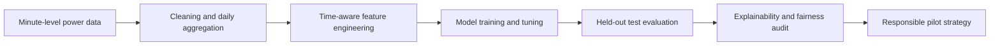

# AI-Powered Household Energy Consumption Prediction and Monitoring System

An end-to-end machine learning capstone that forecasts a household's next-day electricity consumption and investigates how forecasts could support earlier, safer consumption warnings.

The project is motivated by the limited day-to-day visibility many Philippine households have into their electricity use. Monthly bills can reveal unusually high consumption only after it has already occurred. This capstone explores whether a next-day energy forecast can provide an earlier opportunity to monitor usage and take action.

> **Important:** The prototype provides consumption estimates only. It does not calculate, reproduce, or replace an official Meralco bill.

## Project objectives

The project aims to:

- forecast next-day household electricity consumption in kilowatt-hours;
- outperform simple persistence and seasonal-naive baselines;
- identify important drivers of the forecast;
- evaluate whether the forecast can support high-consumption warnings;
- examine model limitations, uncertainty, privacy, and fairness risks; and
- define a responsible path toward validation using Philippine household data.

## Machine learning task

| Component | Definition |
|---|---|
| Primary task | Supervised regression |
| Target | Next-day household electricity consumption in kWh |
| Primary metric | Mean Absolute Error (MAE) |
| Supporting metrics | RMSE, MAPE, R², prediction-interval coverage |
| Warning event | Actual daily use exceeds 120% of the preceding 30-day mean |
| Warning metrics | Precision, recall, F1-score, specificity |

MAE is the primary metric because it expresses forecast error in kWh and is easier for households and business stakeholders to interpret.

## Dataset

The analysis uses the [UCI Individual Household Electric Power Consumption dataset](https://archive.ics.uci.edu/dataset/235/individual+household+electric+power+consumption).

- **Source household:** One household in Sceaux, France
- **Observation period:** December 2006 to November 2010
- **Original frequency:** One-minute measurements
- **Original observations:** 2,075,259 rows
- **Measurement variables:** 7
- **Rows containing missing measurements:** 25,979, or 1.2518%
- **Duplicate timestamps detected:** 0
- **Absent timestamps detected:** 0

After coverage filtering and daily aggregation, 1,417 daily records were usable. Feature creation and historical-window requirements produced 1,147 modeling rows.

### Dataset limitation

The dataset represents one French household. Its results cannot be assumed to represent Meralco customers or the wider Philippine population. Philippine deployment requires local, diverse, consent-based household data and new model validation.

## Project workflow



## Repository structure

```text
capstone/
├── data/
│   ├── raw/                 # Downloaded source data (ignored by Git)
│   ├── interim/             # Intermediate data (ignored by Git)
│   ├── processed/           # Modeling-ready data (ignored by Git)
│   └── README.md            # Dataset source, paths, and handling policy
├── models/                  # Saved models, feature schema, and run configurations
├── src/
│   ├── download_data.py     # Reproducible UCI dataset download
│   └── validate_repository.py # Step 7 structure/artifact checks
├── notebooks/
│   ├── 02_data_collection_and_understanding.ipynb
│   ├── 03_preprocessing_eda_feature_engineering.ipynb
│   ├── 04_model_implementation_and_comparison.ipynb
│   └── 05_bias_fairness_analysis.ipynb
├── outputs/
│   ├── reports/             # Step 1 and final reports (DOCX/PDF)
│   ├── tables/              # Reproducible metrics and audit outputs
│   └── figures/             # Exported charts and explainability figures
├── presentations/
│   ├── 06A_Technical_Presentation_Household_Energy.ipynb
│   └── 06B_Business_Presentation_Household_Energy.pptx
├── environment.yml          # Conda environment specification
├── README.md
└── requirements.txt
```

## Methodology

### Data preparation

- Parsed and validated timestamps.
- Converted measurement columns to numeric values.
- Assessed null values, duplicate timestamps, coverage, and potential outliers.
- Interpolated only short gaps of 60 minutes or less.
- Aggregated minute-level active power into daily kWh.
- Retained days with at least 95% measurement coverage.
- Preserved plausible high-consumption observations rather than automatically deleting them.

### Feature engineering

The project created 42 candidate features, including:

- lagged daily energy consumption;
- rolling means, standard deviations, minimums, and maximums;
- exponentially weighted consumption history;
- recent trends and volatility;
- voltage and sub-metering behavior; and
- cyclical day-of-week and annual calendar features.

Historical consumption features were shifted before rolling calculations to prevent future-data leakage. Feature selection reduced the final model input to 22 features.

### Time-aware experimental design

Random train-test splitting was avoided because it would allow later observations to influence earlier forecasts.

| Split | Rows | Date range | Purpose |
|---|---:|---|---|
| Training | 802 | 2007-01-16 to 2009-05-30 | Model fitting and time-series cross-validation |
| Validation | 172 | 2009-05-31 to 2010-02-23 | Model selection and hyperparameter tuning |
| Test | 173 | 2010-02-24 to 2010-11-25 | One-time final evaluation |

The final model was selected using validation MAE before evaluating the test set.

## Models evaluated

- Persistence baseline
- Seasonal-naive baseline
- Ridge Regression
- Random Forest Regressor
- XGBoost Regressor

### Validation comparison

| Model | Validation MAE | Validation RMSE | Validation MAPE | Validation R² |
|---|---:|---:|---:|---:|
| Seasonal naive | 5.6091 | 7.1561 | 23.23% | 0.3463 |
| Ridge Regression | 4.2613 | 5.5355 | 18.65% | 0.6089 |
| Random Forest | 4.1311 | 5.3706 | 17.36% | 0.6318 |
| **XGBoost** | **4.0415** | **5.3451** | **16.77%** | **0.6353** |

XGBoost achieved the lowest validation MAE and was selected as the final model.

## Final test results

| Metric | XGBoost | Seasonal-naive baseline |
|---|---:|---:|
| MAE | **3.7232 kWh** | 5.7282 kWh |
| RMSE | **5.1040 kWh** | 7.8624 kWh |
| MAPE | **18.73%** | 28.62% |
| R² | **0.5458** | -0.0777 |

The selected model reduced test MAE by approximately **35%** compared with the seasonal-naive baseline.

### Forecast uncertainty

- Bootstrap 95% confidence interval for test MAE: **3.2278–4.2559 kWh**
- Calibrated 90% prediction-band radius: **±8.677 kWh**
- Observed test prediction-band coverage: **93.06%**

## Explainability

The project uses SHAP, LIME, partial dependence plots, individual conditional expectation, and model-based feature importance.

Important predictive signals included:

1. previous-day energy consumption;
2. seven-day exponentially weighted consumption;
3. annual cyclical position;
4. fourteen-day rolling maximum consumption; and
5. previous-day voltage variability.

These explanations describe statistical model behavior. They should not automatically be interpreted as causal relationships.

## High-consumption warning evaluation

The original warning rule produced the following held-out test performance:

| Metric | Result |
|---|---:|
| Precision | 71.43% |
| Recall | 21.74% |
| F1-score | 33.33% |
| Specificity | 98.67% |
| High-use days detected | 5 of 23 |

Although the model forecasts ordinary days reasonably well, it misses many high-consumption days. High-day MAE was 7.5540 kWh compared with 3.1358 kWh for normal days, and 91.3% of high-use days were underpredicted.

The current system should therefore be treated as a forecasting prototype, not a dependable bill-shock alarm. The proposed application can explore configurable **Watch**, **Moderate**, and **High** advisory levels, but these must be calibrated and validated during a Philippine pilot.

## Ethical AI, bias, and fairness

The source dataset does not include gender, race, age, income, socioeconomic status, or observations from multiple households. Consequently, demographic parity, equalized odds, and disparate impact cannot be validly calculated.

The project instead reports operational subgroup diagnostics by season, weekday/weekend, consumption quartile, and high-use status. These diagnostics must not be presented as evidence of demographic fairness.

Key risks and proposed safeguards include:

| Risk | Safeguard |
|---|---|
| Geographic transfer | Retrain and validate using diverse Philippine households |
| Privacy | Obtain informed consent, minimize data collection, and secure retention |
| High-use under-detection | Tune warning thresholds and prioritize recall during the pilot |
| Alert fatigue | Use configurable sensitivity and monitor false alerts and opt-outs |
| Temporal drift | Monitor performance and recalibrate periodically |
| Energy-burden inequity | Evaluate outcomes across approved socioeconomic groups when suitable data exists |

## Installation

### 1. Clone the repository

```bash
git clone https://github.com/yhingyu/capstone.git
cd capstone
```

### 2. Create the Anaconda environment

If `environment.yml` is available:

```bash
conda env create -f environment.yml
conda activate household-energy-capstone
```

If the environment has already been created:

```bash
conda env update -f environment.yml --prune
conda activate household-energy-capstone
```

### 3. Register the Jupyter kernel

```bash
python -m ipykernel install --user \
  --name household-energy-capstone \
  --display-name "Python (Household Energy Capstone)"
```

### 4. Start Jupyter

```bash
jupyter lab
```

## Downloading the dataset

Download and extract the official UCI dataset automatically from the repository root:

```bash
python src/download_data.py
```

Alternatively, download it from the [UCI dataset page](https://archive.ics.uci.edu/dataset/235/individual+household+electric+power+consumption), extract it, and place the source text file at `data/raw/household_power_consumption.txt`.

The raw dataset is large and should normally be excluded from Git using `.gitignore`. The notebooks should document the download source and recreate derived files from the raw data.

## Reproducing the analysis

Run the notebooks in numerical order:

1. Review `outputs/reports/01_Problem_Understanding_and_Framing.docx` (Step 1).
2. Run `notebooks/02_data_collection_and_understanding.ipynb`.
3. Run `notebooks/03_preprocessing_eda_feature_engineering.ipynb`.
4. Run `notebooks/04_model_implementation_and_comparison.ipynb`.
5. Run `notebooks/05_bias_fairness_analysis.ipynb`.

Before running them:

- activate the correct Conda environment;
- confirm the raw dataset path;
- use the repository root as the working directory; and
- preserve the fixed chronological splits and random seeds used in the notebooks.

Generated models, preprocessors, and configurations should be saved under `models/`. Final written reports should be saved under `outputs/reports/`, while generated charts and explainability figures should be saved under `outputs/figures/`.

## Presentations

- **Technical presentation:** `presentations/06A_Technical_Presentation_Household_Energy.ipynb`
- **Business presentation:** `presentations/06B_Business_Presentation_Household_Energy.pptx`

Run all cells in the technical presentation before starting its slideshow so that generated charts are included.

### Running the technical Jupyter presentation

From the root of the capstone repository, activate the Conda environment:

```bash
conda activate household-energy-capstone
```

Open the technical deck in JupyterLab:

```bash
jupyter lab presentations/06A_Technical_Presentation_Household_Energy.ipynb
```

In JupyterLab, select **Run → Run All Cells** and save the notebook. This ensures that all charts and code outputs appear during the presentation.

To launch the notebook as a browser-based Reveal.js slideshow, run:

```bash
jupyter nbconvert \
  presentations/06A_Technical_Presentation_Household_Energy.ipynb \
  --to slides \
  --post serve
```

The command exports the notebook as an HTML slideshow, starts a local web server, and opens the presentation in a browser. Keep the terminal running while presenting. Press `Ctrl+C` in the terminal when the presentation is finished.

Common presentation controls:

| Key | Action |
|---|---|
| `Right Arrow` or `Space` | Next slide |
| `Left Arrow` | Previous slide |
| `Esc` | Slide overview |
| `F` | Full-screen presentation |
| `S` | Speaker notes window, when supported |

To export the slideshow without starting a local server:

```bash
jupyter nbconvert \
  presentations/06A_Technical_Presentation_Household_Energy.ipynb \
  --to slides
```

This creates an HTML file beside the notebook. The Reveal.js assets may require an internet connection unless they are configured for local use.

## Repository validation

Run the Step 7 checks after cloning or before submission:

```bash
python src/validate_repository.py
```

The validator confirms that required deliverables exist, JSON and CSV artifacts are readable, no tracked deliverable is empty, the final model and feature schema are present, and the notebook numbering is consistent. A GitHub Actions workflow runs the same checks on every push and pull request.

## Final submission deliverables

- Public repository: <https://github.com/yhingyu/capstone>
- Final report: `outputs/reports/07_Final_Capstone_Report_Household_Energy_Monitoring.pdf`
- Editable report: `outputs/reports/07_Final_Capstone_Report_Household_Energy_Monitoring.docx`
- Reproducible notebooks: `notebooks/02_*.ipynb` through `notebooks/05_*.ipynb`
- Saved final model: `models/final_energy_forecast_model.joblib`
- Reproducibility metadata: `models/step4_run_metadata.json`

## Step 8: Dockerized deployment and MLOps POC

The repository includes a local **Dash proof of concept** that loads the saved XGBoost model and forecasts next-day household consumption. Users can upload CSV/Excel readings or add daily readings manually. The interface shows a 90% prediction band, configurable advisory level, and illustrative PHP cost estimate.

Run it with Docker:

```bash
docker compose up --build
```

Open <http://localhost:8050>. Full instructions, supported input schemas, testing commands, local MLflow tracking, monitoring, versioning, rollback, and the recommended future cloud architecture are documented in [docs/STEP8_DEPLOYMENT.md](docs/STEP8_DEPLOYMENT.md).

This deployment is a POC. It is trained on one French household, has limited high-use warning recall, and must not be treated as an official Meralco billing or safety system. Cloud deployment is intentionally not implemented at this stage. Demo media will be added after interactive acceptance testing.

## Step 8 POC Demonstration

A recorded demonstration is available at
[demo/08_dashboard_demo.mp4](demo/08_dashboard_demo.mp4).

## Responsible use statement

This project is an academic prototype. It must not be used to determine an official electricity bill, disconnect service, penalize a household, or make high-stakes financial decisions. Any real-world implementation should undergo local data validation, security and privacy review, user testing, drift monitoring, and a new fairness assessment.

## Proposed next steps

1. Collect diverse Philippine household consumption data with informed consent.
2. Compare the prototype with local seasonal and tariff-related baselines.
3. Calibrate advisory warning levels for both recall and alert fatigue.
4. Conduct a silent forecasting stage before sending customer alerts.
5. Measure engagement, avoided kWh, tariff-adjusted savings, and operating cost.
6. Reassess privacy, fairness, and model drift before broader deployment.

## Author

**Edixon D. Yu Jr.**  
Postgraduate Diploma in Artificial Intelligence and Machine Learning  
Capstone Project, 2026

## Acknowledgment and citation

Dataset:

> Hebrail, G. and Berard, A. Individual Household Electric Power Consumption. UCI Machine Learning Repository. [https://doi.org/10.24432/C58K54/](https://doi.org/10.24432/C58K54/)

Philippine household electricity access and Meralco-related public information are used only to frame the local business problem. The modeling dataset does not contain Meralco customer records.
